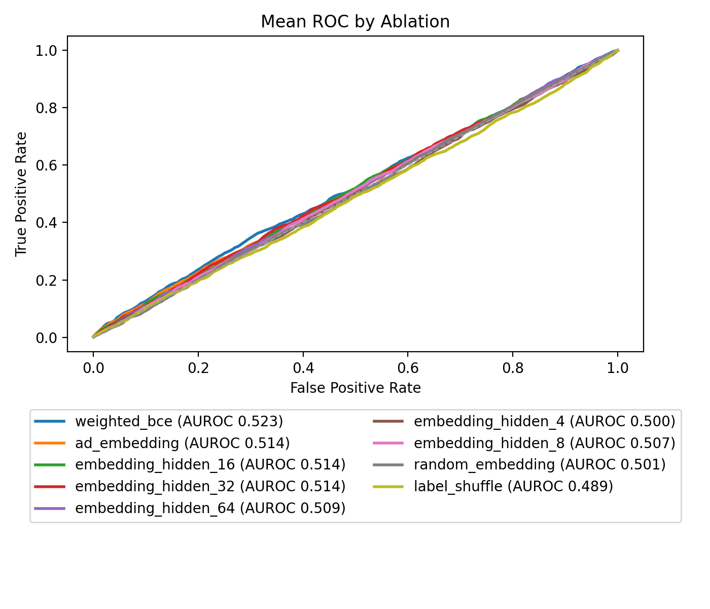
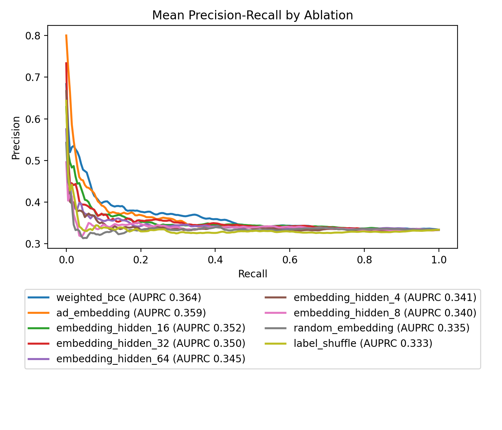
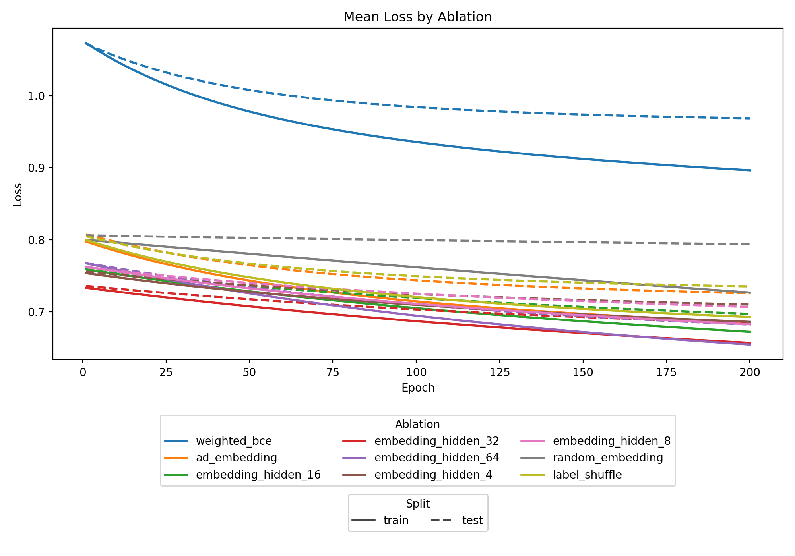

# Brain-region–aware, BBB-conditioned virtual screening for Alzheimer’s disease

## Sample Results Dashboard
The experiment runner writes per-run ROC, precision-recall, and loss curves for each ablation. Below is a dashboard showing the latest curated results for AD prediction on the Allen human brain bulk RNA-seq dataset, trained on DrugCLIP protein embeddings with matched AD/control labels and summarized across the ablation sweep. The README figures are sourced from manually curated golden files under `documents/readme/ad_predictor/`.

Experiment scale from [`documents/readme/ad_predictor/summary.csv`](documents/readme/ad_predictor/summary.csv): `762` total labeled protein samples, with `254` positives and `508` negatives. These labels are constructed by combining the Allen human brain bulk RNA-seq dataset with the curated AD gene list in [`data/processed/ad_genes.csv`](data/processed/ad_genes.csv), then selecting expression-matched controls at a ratio of two controls per AD gene. The reported metrics come from `5`-fold cross-validation, with an average split size of `609.6` train and `152.4` test samples per fold.

Summary from [`documents/readme/ad_predictor/summary_by_ablation.csv`](documents/readme/ad_predictor/summary_by_ablation.csv):

| Ablation | Mean test AUROC | Mean test AUPRC | Samples |
| --- | ---: | ---: | ---: |
| `weighted_bce` | 0.545 | 0.391 | 762 |
| `random_embedding` | 0.518 | 0.354 | 762 |
| `ad_embedding` | 0.515 | 0.350 | 762 |
| `label_shuffle` | 0.483 | 0.338 | 762 |

Abbreviated meaning of each ablation:
- `ad_embedding`: linear probe trained on the real DrugCLIP protein embeddings with standard binary cross-entropy.
- `weighted_bce`: same real-embedding probe, but with weighted binary cross-entropy to upweight the AD class based on the training-fold class ratio.
- `random_embedding`: control where the embedding vectors are replaced with Gaussian noise before training.
- `label_shuffle`: control where the training labels are permuted within each fold while the held-out test labels remain real.

| Mean ROC | Mean PR | Mean loss |
| --- | --- | --- |
|  |  |  |

This gives a quick visual comparison of the aggregate ROC, precision-recall, and train/test loss behavior across ablations. Golden README artifacts should be updated manually in `documents/readme/ad_predictor/` when you want to refresh the dashboard.

## Setup
- Create the env: `conda env create -f environment.yml`
- Activate it: `conda activate ad_screening`
- Install the package in editable mode: `python -m pip install -e .`
- Install git hooks: `pre-commit install`

After modifying deps in `environment.yml`,  sync env with: `conda env update -n ad_screening -f environment.yml --prune`

## Data
Download and extract all datasets: `python src/scripts/download_data.py`

---

### Dataset: AD Gene Compilation
The current AD-positive label set is sourced from the curated AD protein supplement workbook [`data/download/41467_2023_40208_MOESM4_ESM.xlsx`](data/download/41467_2023_40208_MOESM4_ESM.xlsx), using `Supplementary Data 2` as the upstream source table.

The local processing step is intentionally simple:
- read the `Gene` column
- split semicolon-delimited multi-gene entries into one gene per row
- normalize symbols to uppercase
- deduplicate
- write the result to [`data/processed/ad_genes.csv`](data/processed/ad_genes.csv)

This makes the existing dataset valid as a reproducible operational AD gene list for the current probing experiments: the curation is inherited from the external supplement, while this repo only performs normalization and expansion into a machine-usable format.

We plan to extend this compilation in future iterations with additional evidence sources such as GWAS-based AD gene sets, rather than treating the current supplement as the final or exhaustive definition of AD-associated genes.

---

### Dataset: GWAS
TODO

## Run Experiments
The main entrypoint is [`src/scripts/run_experiment.py`](src/scripts/run_experiment.py).

Run the AD predictor experiment with:
`python src/scripts/run_experiment.py --experiment ad_predictor`

Relationship between the pieces:
- An experiment file such as [`experiments/ad_predictor.yaml`](experiments/ad_predictor.yaml) defines a sweep. It declares the implementation name, shared defaults, the number of seeds, and the ablation-specific overrides.
- [`src/scripts/run_experiment.py`](src/scripts/run_experiment.py) is the orchestrator. It loads `experiments/{name}.yaml`, expands the ablations and seeds into concrete runs, and dispatches each run to the requested implementation.
- The implementation for `ad_predictor` lives in [`src/package/ad_predictor.py`](src/package/ad_predictor.py). It exposes `run_ad_predictor(...)`, which receives the experiment YAML, the selected ablation name, the seed, and the output directory for a single run.
- Outputs are written under `results/{experiment_name}/experiment_runs_<timestamp>/...`, with one subdirectory per ablation and seed plus aggregate summaries at the run root.

Basic usage:
`python src/scripts/run_experiment.py --experiment ad_predictor`

Useful examples:
- First local run with automatic data bootstrap: `python src/scripts/run_experiment.py --experiment ad_predictor --bootstrap-data`
- Run with up to 4 concurrent worker threads: `python src/scripts/run_experiment.py --experiment ad_predictor --num-threads 4`
- Write outputs to a custom directory: `python src/scripts/run_experiment.py --experiment ad_predictor --results-dir scratch_results`

CLI flags:
- `--experiment`: choose the experiment, matched to `experiments/{name}.yaml` and `results/{name}/...`
- `--bootstrap-data`: download missing required inputs before launching the run
- `--num-threads`: set the maximum number of experiment runs the launcher executes concurrently
- `--results-dir`: write run outputs somewhere other than `results/`
